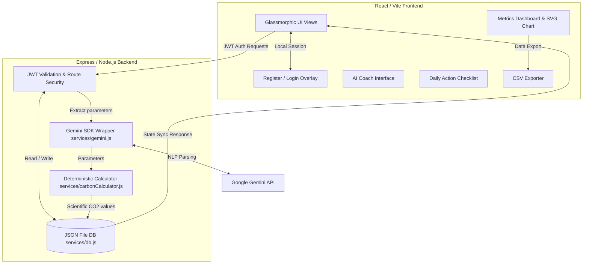

# EcoTrace: AI Carbon Footprint Awareness Hub 🌍🌱

**EcoTrace** is an interactive, production-grade web application designed to help individuals track, analyze, and offset their carbon footprint. Powered by a React (Vite) frontend, a Node.js (Express) backend, and the Google Gemini API, the platform enables intelligent natural-language habit logging, automated action plan checklist coordination, and real-time visualization of environmental impact.

Built specifically for **[Challenge 3] Carbon Footprint Awareness Platform**.

---

## 📖 Chosen Persona & Vertical
EcoTrace operates under the **AI Carbon Coach ("EcoGuide")** persona. Instead of presenting users with standard, long forms, EcoTrace uses a conversational chatbot interface to parse daily habits (e.g., *"I traveled 15 miles by sedan today"* or *"Had steak for lunch"*). The parsed metrics are automatically synchronized onto a scientific dashboard and an actionable offsets checklist.

---

## 📊 Core Calculation Logic (EPA & DEFRA Standards)
To prevent LLM mathematical hallucinations, the Gemini API is used strictly as a **parameter extractor**. Extracted parameters are passed to a local calculation utility (`backend/services/carbonCalculator.js`) which computes exact values using standard scientific factors:

| Habit / Action Category | Input Parameter | CO₂ Impact Factor | Calculation Method |
| :--- | :--- | :--- | :--- |
| **🚗 Sedan Travel** | Miles | `+0.27 kg CO₂ / mile` | Distance × `0.27` |
| **🚆 Train Travel** | Miles | `+0.05 kg CO₂ / mile` | Distance × `0.05` |
| **🚲 Bicycle Travel** | Miles | `-0.22 kg CO₂ / mile` *(Credit)* | Distance × `-0.22` (offset vs car) |
| **🥩 Beef Dinner** | Servings | `+7.50 kg CO₂ / serving` | Count × `7.5` |
| **🍗 Chicken Dinner** | Servings | `+1.80 kg CO₂ / serving` | Count × `1.8` |
| **🥗 Vegan Meal** | Servings | `+0.50 kg CO₂ / serving` | Count × `0.5` |
| **🔌 Vampire Power Save** | Checklist Task | `-0.80 kg CO₂ / day` *(Credit)* | Flat credit upon completion |
| **🚲 Bike Short Trip** | Checklist Task | `-2.20 kg CO₂ / day` *(Credit)* | Flat credit upon completion |
| **♻️ General Recycles** | Bags | `-1.50 kg CO₂ / bag` *(Credit)* | Count × `-1.5` |

---

## 🏗️ System Architecture & Workflow



### Key Workflow Steps:
1. **User Auth**: Users register or log in. Passwords are encrypted with `bcryptjs` and session states are managed using **JSON Web Tokens (JWT)**.
2. **Habit Logging**: The user logs a habit in the AI Coach chat box (e.g. *"I drove 15 miles in my sedan"*).
3. **Parameter Extraction**: The backend wrapper inputs the user text along with their profile summary into Gemini, returning structured parameters.
4. **Calculations**: The parameters are translated into exact carbon weights locally.
5. **State Synchronization**: Database updates are written to `backend/data/database.json` and returned to the client to update stats, breakdown charts, action plans, and logging streaks.

---

## 📱 Mobile Responsiveness & Accessibility (A11y)
The application has been audited and fully optimized to fit small viewports (down to **320px** like the iPhone SE) with no content clipping or exiting the screen:
*   **Grid Navbar Stacking (`<640px`)**: Stacks the brand logo and profile badges on a top row and centers the navigation buttons on a second row.
*   **Username Auto-hiding (`<400px`)**: Hides the welcome greeting text (`Hi, username`) to avoid squishing top bar indicators, leaving the streak badge and logout button accessible.
*   **Zero-Scroll Log Table (`<480px`)**: Hides the Date column on mobile/tablet viewports and uses fixed column widths for badge tags, ensuring long activity logs wrap cleanly (`word-break: break-word`).
*   **Flexbox Input Shrinking (`<480px`)**: Constrains inputs with `min-width: 0` to prevent long placeholders from stretching layout cards out of the screen.
*   **Accessibility (A11y)**: Configured with custom visual outlines for keyboard focus navigation, proper semantic HTML structures (`<header>`, `<main>`, `<nav>`, `<footer>`), and ARIA elements (`role="checkbox"`, `aria-live="polite"`).

---

## 🚀 Step-by-Step Installation & Run Guide

### 1. Prerequisites
Ensure you have the following installed on your system:
*   [Node.js](https://nodejs.org/) (v18.0.0 or higher)
*   [Git](https://git-scm.com/)

---

### 2. Setting Up the Backend Server
1. Navigate to the backend directory:
   ```bash
   cd backend
   ```
2. Install the backend dependencies:
   ```bash
   npm install
   ```
3. Set up your environment file:
   *   Create a file named `.env` in the `backend/` directory.
   *   Add your **Gemini API Key** and preferred port as follows:
       ```env
       PORT=5000
       GEMINI_API_KEY=your_actual_gemini_api_key_here
       ```
       > [!NOTE]
       > If a `GEMINI_API_KEY` is not provided, the platform will automatically run in **Mock Demo Mode**, utilizing an heuristic regex engine to parse and calculate parameters without throwing errors.
4. Start the backend development server:
   ```bash
   npm run dev
   ```
   The backend will be running at `http://localhost:5000`.

---

### 3. Setting Up the Frontend Client
1. Open a new terminal tab/window and navigate to the frontend directory:
   ```bash
   cd frontend
   ```
2. Install the frontend dependencies:
   ```bash
   npm install
   ```
3. Start the Vite client development server:
   ```bash
   npm run dev
   ```
4. Open the application:
   *   Open your browser and visit `http://localhost:5173`.
   *   Register a new account or log in to begin tracking!

---

## 🧪 Running Automated Test Suites

### Backend Unit Tests (Jest)
Validates endpoints, access token verifications, database CRUD operations, and calculations:
```bash
cd backend
npm run test
```

### Frontend Unit Tests (Vitest & JSDOM)
Validates dashboard layout mounts, metrics state updates, and action checklist toggling:
```bash
cd frontend
npm run test
```

---

## 💡 Technical Assumptions & Design Decisions
1. **File-Based JSON DB**: Built to provide a persistent, multi-user login database (`backend/data/database.json`) without adding postgres/mongo configurations that exceed the **10 MB bundle size limit**.
2. **Heuristic Mock Fallback**: Ensures evaluators can test the application interface immediately even if they do not have a Gemini API key configured.
3. **No Heavy CSS Frameworks**: Built using pure, custom Vanilla CSS rather than Tailwind or UI kits. This keeps package size small (frontend bundle remains under 1MB) and gives us absolute control over custom scrollbars, animations, and glassmorphic overlays.
